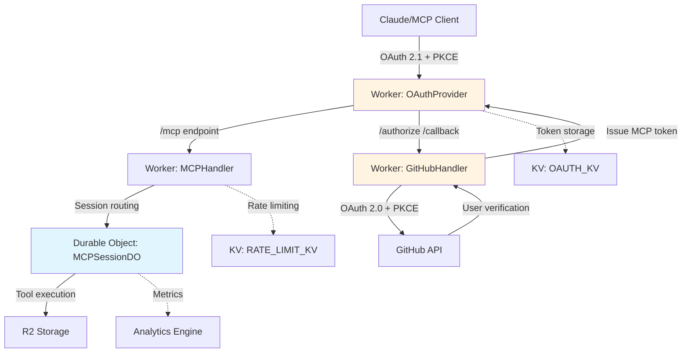
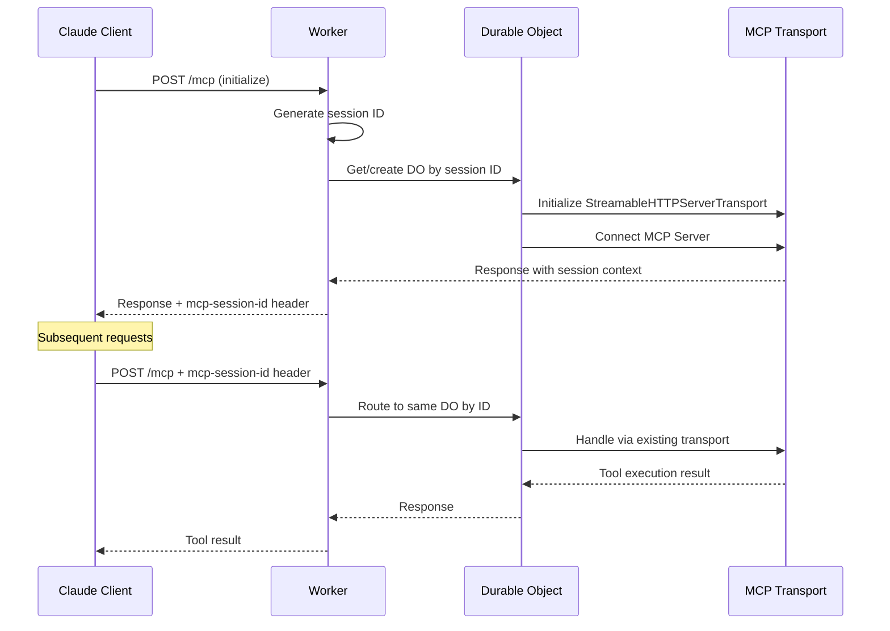
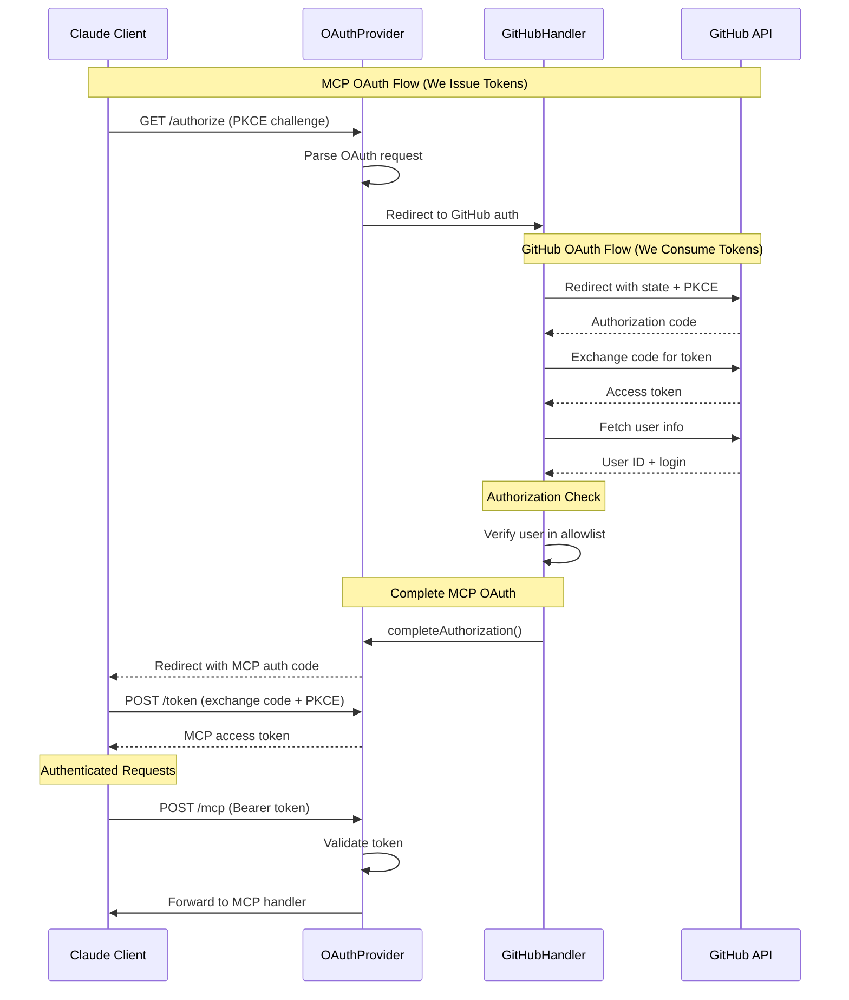
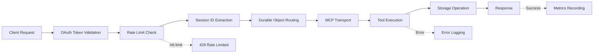

# Technical Architecture

---

## Stack

- **Platform**: Cloudflare Workers (serverless edge compute)
- **Protocol**: Model Context Protocol (MCP) v2025-03-26 via `@modelcontextprotocol/sdk`
- **OAuth SERVER**: `@cloudflare/workers-oauth-provider` v0.0.11 (issues MCP tokens with PKCE)
- **OAuth CLIENT**: Arctic v3.7.0 (GitHub authentication for user verification)
- **Storage**: Cloudflare R2 (object storage, single bucket)
- **Session Management**: Cloudflare Durable Objects (stateful MCP sessions)
- **Transport**: Streamable HTTP with JSON response mode (not SSE)
- **Observability**: Structured JSON logging + Cloudflare Analytics Engine
- **Version**: 1.2.18

---

## Core Architecture Pattern



### Dual OAuth Architecture

**Flow 1: OAuth SERVER (We issue tokens)**
- MCP clients authenticate WITH US
- We issue MCP access tokens via `@cloudflare/workers-oauth-provider`
- Includes PKCE (OAuth 2.1 requirement for public clients)

**Flow 2: OAuth CLIENT (We consume tokens)**
- We authenticate WITH GitHub via Arctic library
- GitHub verifies user identity
- We check user against allowlist (`GITHUB_ALLOWED_USER_ID`)
- GitHub tokens are consumed, NOT passed to MCP clients

### Session Management via Durable Objects

Each MCP session runs in its own Durable Object instance:



**Why Durable Objects?**
- Workers are stateless, but MCP transport requires stateful session management
- Each session ID maps directly to a Durable Object ID (consistent routing)
- Provides strongly-consistent storage per session
- Automatic hibernation reduces costs (well within free tier)
- Built-in alarm system for session timeout (30 minutes idle)

---

## Authentication & Authorization Flow



**Critical Security Points:**
1. Two separate OAuth flows (we are BOTH server AND client)
2. PKCE required for both flows (OAuth 2.1 compliance)
3. GitHub tokens never leave our server
4. User allowlist enforced before issuing MCP tokens
5. MCP tokens validated on every request

---

## Request Flow

### Tool Call Lifecycle



1. **Authentication**: OAuthProvider validates token from `OAUTH_KV`
2. **Rate Limiting**: Check user limits in `RATE_LIMIT_KV` (100/min, 1000/hr, 10000/day)
3. **Session Routing**: Extract `mcp-session-id` header or generate for initialize
4. **Durable Object**: Route to session-specific DO by ID
5. **Tool Execution**: Execute tool via MCP transport
6. **Storage**: Perform R2 operation with quota enforcement (10GB, 10k files, 10MB/file)
7. **Response**: Return JSON result (not SSE stream)
8. **Observability**: Log to structured JSON + record metrics

### Storage Organization

Flat path structure in single R2 bucket:
```
projects/app-name/notes.md
areas/health/fitness-log.md
resources/productivity/basb-notes.md
archives/2024/old-project/summary.md
```

No enforced hierarchy - structure emerges from user's file paths following BASB/PARA principles.

---

## Component Architecture

### Layer Overview

```
┌─────────────────────────────────────────────────────┐
│  Entry Point (index.ts)                             │
│  - OAuthProvider configuration                      │
│  - Route configuration                              │
│  - Environment bindings                             │
└────────────┬────────────────────────────────────────┘
             │
      ┌──────┴──────┐
      │             │
┌─────▼──────┐ ┌───▼──────────────┐
│ OAuth UI   │ │ MCP API Handler  │
│ Handler    │ │ (Authenticated)  │
└─────┬──────┘ └───┬──────────────┘
      │            │
      │         ┌──▼───────────────┐
      │         │ Durable Object   │
      │         │ (Session DO)     │
      │         └──┬───────────────┘
      │            │
      │         ┌──▼──────────┐
      │         │ MCP         │
      │         │ Transport   │
      │         └──┬──────────┘
      │            │
      │         ┌──▼──────────┐
      │         │ Tool        │
      │         │ Executor    │
      │         └──┬──────────┘
      │            │
┌─────▼────────────▼──────────┐
│  Cross-Cutting Concerns     │
│  - Logger (structured JSON) │
│  - Monitoring (Analytics)   │
│  - Storage (R2 wrapper)     │
│  - Rate Limiter (KV)        │
└─────────────────────────────┘
```

### 1. Worker Entry Point ([index.ts](../src/index.ts))

Exports OAuthProvider as default handler:
- Configures OAuth endpoints (`/authorize`, `/token`, `/register`)
- Routes `/mcp` to authenticated MCPHandler
- Routes default to GitHubHandler (OAuth UI)
- Exports Durable Object class for runtime

### 2. GitHub OAuth UI Handler ([oauth-ui-handler.ts](../src/oauth-ui-handler.ts))

Handles GitHub authentication flow (OAuth CLIENT role):
- `/authorize` - Parse MCP request → redirect to GitHub
- `/callback` - Exchange code → verify user → complete MCP OAuth
- Uses abstracted `GitHubOAuthProvider` interface for testability
- Production: Arctic library implementation
- Testing: Mock provider implementation

**Testability Pattern:**
```typescript
// Interface abstraction (github-oauth-provider.ts)
interface GitHubOAuthProvider {
  createAuthorizationURL(state: string, scopes: string[]): URL;
  validateAuthorizationCode(code: string): Promise<GitHubTokens>;
  getUserInfo(accessToken: string): Promise<GitHubUser>;
}

// Production: Arctic wrapper (github-oauth-provider-arctic.ts)
// Testing: Mock implementation (test/mocks/github-oauth-provider-mock.ts)
```

### 3. MCP API Handler ([mcp-api-handler.ts](../src/mcp-api-handler.ts))

Handles authenticated MCP requests (after OAuth validation):
- Extract user props from OAuthProvider context
- Enforce rate limits
- Extract or generate session ID
- Route to Durable Object by session ID
- Add `mcp-session-id` to response headers

### 4. MCP Session Durable Object ([mcp-session-do.ts](../src/mcp-session-do.ts))

**Stateful session management:**
- One instance per MCP session (session ID = DO ID)
- Holds `StreamableHTTPServerTransport` and `Server` instances
- Handles GET (session info), POST (tool calls), DELETE (terminate)
- **Session timeout**: 30-minute idle timeout via alarm system
- **Cleanup**: Automatic resource cleanup on timeout or DELETE

**Critical Implementation Detail:**
The MCP SDK's `StreamableHTTPServerTransport.handleRequest()` resolves before writing response. Must wait for BOTH:
```typescript
// Wait for handleRequest AND response.end()
await Promise.all([
  transport.handleRequest(nodeRequest, nodeResponse, body),
  endPromise  // Resolves when response.end() is called
]);
```

**Session Configuration:**
```typescript
new StreamableHTTPServerTransport({
  sessionIdGenerator: () => doSessionId, // Use Worker-generated ID
  enableJsonResponse: true, // JSON responses, not SSE
  onsessioninitialized: (id) => logger.info('Session initialized'),
  onsessionclosed: (id) => cleanup(),
})
```

### 5. MCP Transport ([mcp-transport.ts](../src/mcp-transport.ts))

**MCP protocol implementation:**
- Server initialization with metadata (name, version, instructions)
- Tool registration (read, write, edit, glob, grep)
- Prompt registration (capture-note, weekly-review, research-summary)
- Tool execution with rate limiting and bootstrapping
- Request/response handling via MCP SDK

### 6. Tool Implementations ([tools/](../src/tools/))

- **read.ts** - File reading with optional range and byte limits
- **write.ts** - File creation/overwrite with size validation
- **edit.ts** - String replacement + move/rename/delete operations
- **glob.ts** - Pattern-based file search (supports `**/*.md` patterns)
- **grep.ts** - Regex content search with context lines

All tools use Zod schemas for parameter validation and enforce security constraints.

### 7. Cross-Cutting Concerns

**Logger** ([logger.ts](../src/logger.ts)):
- Structured JSON logging for Cloudflare Workers Logs
- Request correlation via UUID (`crypto.randomUUID()`)
- Context propagation through child loggers
- Log levels: DEBUG, INFO, WARN, ERROR

**Monitoring** ([monitoring.ts](../src/monitoring.ts)):
- Analytics Engine integration
- Metrics: tool calls, OAuth events, rate limits, storage, errors
- User ID anonymization (SHA-256 hash)
- Silent failure (never breaks app)

**Storage** ([storage.ts](../src/storage.ts)):
- R2 API wrapper with error handling
- Quota enforcement (10GB total, 10k files, 10MB per file)
- Metadata management

**Rate Limiting** ([rate-limiting.ts](../src/rate-limiting.ts)):
- KV-based counters with TTL
- Multiple windows (minute, hour, day)
- Limits: 100/min, 1000/hr, 10000/day

---

## Design Principles

### 1. Testability Through Abstraction

External dependencies are abstracted behind interfaces:
- **GitHubOAuthProvider**: Arctic in production, mock in tests
- **Environment bindings**: Injected via Cloudflare bindings system
- **No global state**: All state passed explicitly or stored in DO

### 2. Security by Default

- Path validation (no `..`, null bytes, control chars)
- Size limits enforced before operations
- User allowlist for authorization
- Token validation on every request
- No PII in logs (anonymized user IDs)

### 3. Observability First

- Every request gets unique requestId
- Structured logging throughout
- Metrics recorded for all operations
- Error context preserved (with stack traces)

### 4. Fail Gracefully

- User-facing: Generic error messages + HTTP status codes
- Internal: Detailed logs with full context
- Monitoring failures are silent (never break app)

---

## Scalability Considerations

### Current State (Single User)
- Single R2 bucket
- User ID in environment variable (`GITHUB_ALLOWED_USER_ID`)
- Simple allowlist check

### Future Multi-User Support
Path prefixing strategy preserves flat structure:
```
users/{user_id}/projects/app/notes.md
users/{user_id}/areas/health/log.md
```

No architectural changes needed - just:
1. Add user ID prefix to all R2 paths
2. Store allowlist in KV or D1 instead of env var
3. Per-user rate limits and quotas (already supported)

---

## Cost Profile (Cloudflare Free Tier)

**Well within free limits for personal use:**

| Service | Free Tier | Typical Usage |
|---------|-----------|---------------|
| Workers | 100K requests/day | ~1K/day |
| Durable Objects | 100K requests/day | ~1K/day |
| R2 Storage | 10GB | < 1GB |
| R2 Operations | 1M reads/mo, 1M writes/mo | ~30K/mo |
| KV | 100K reads/day, 1K writes/day | ~100 reads, ~10 writes/day |
| Analytics Engine | 10M events/mo | ~50K/mo |

**Key cost optimizations:**
- Durable Objects hibernate when idle
- R2 has no egress fees
- KV used sparingly (rate limits, OAuth tokens)
- Analytics Engine is highly efficient

---

## Related Documentation

- [Overview](./overview.md) - Project background and philosophy
- [API Reference](./api-reference.md) - Tool specifications and schemas
- [Security](./security.md) - OAuth architecture and security model
- [Deployment](./deployment.md) - Setup, configuration, and CI/CD
- [Monitoring](./monitoring.md) - Observability and debugging
- [Testing](./testing.md) - Test strategy and requirements
