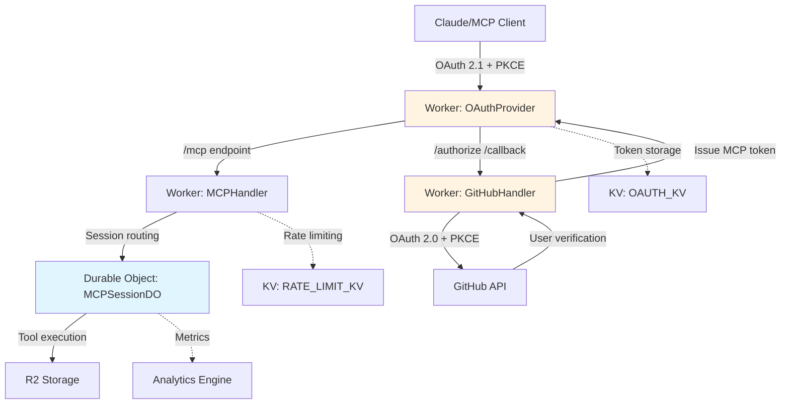
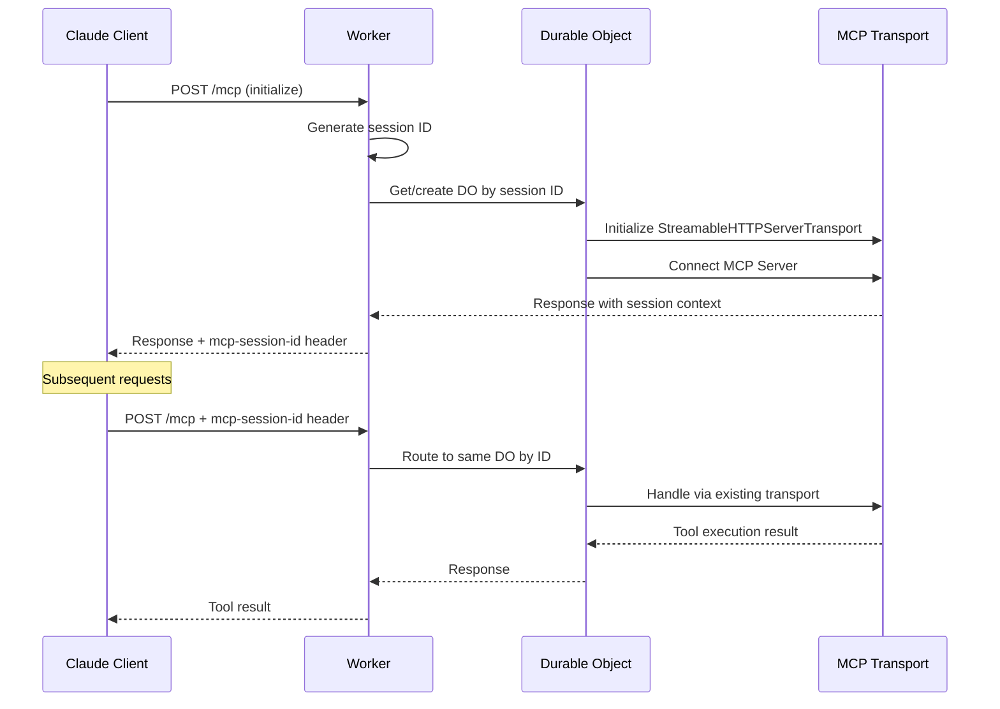
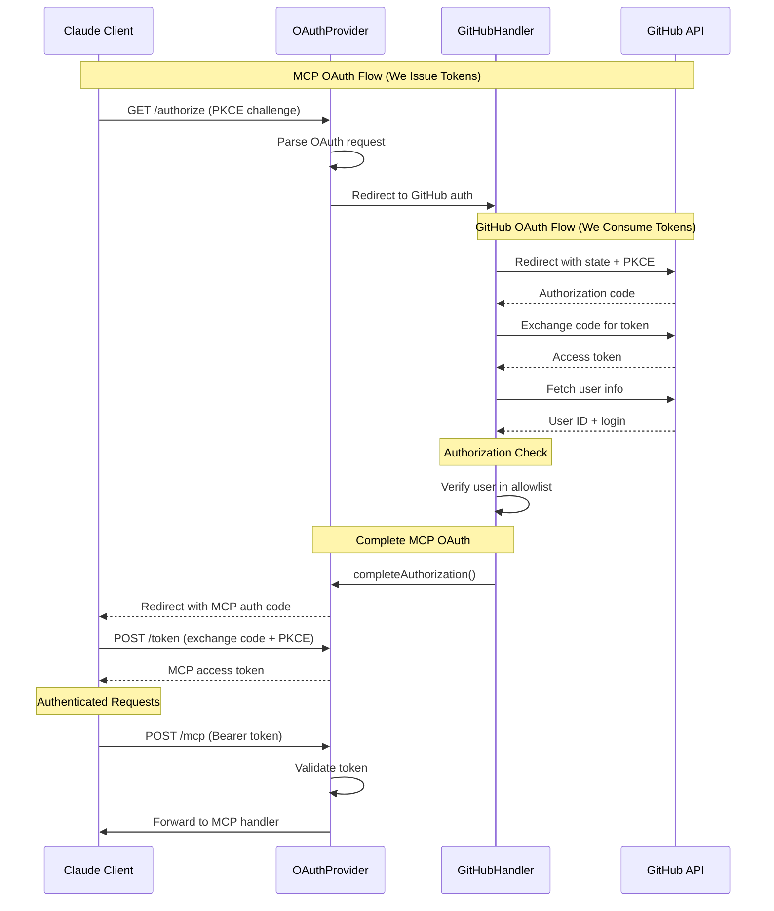
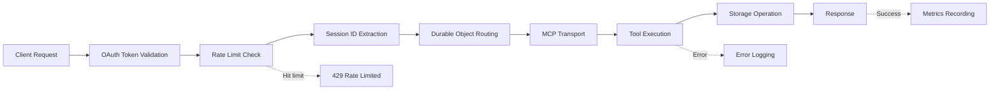

# Technical Architecture

---

## Stack

- **Platform**: Cloudflare Workers (serverless edge compute)
- **Protocol**: Model Context Protocol (MCP) v2025-03-26 via `@modelcontextprotocol/sdk`
- **OAuth SERVER**: `@cloudflare/workers-oauth-provider` v0.0.11 (issues MCP tokens with PKCE)
- **OAuth CLIENT**: Arctic v3.7.0 (GitHub authentication for user verification)
- **Storage**: Cloudflare R2 (object storage, single bucket)
- **Session Management**: Cloudflare Durable Objects (stateful MCP sessions)
- **Transport**: Streamable HTTP with JSON response mode (not SSE)
- **Observability**: Structured JSON logging + Cloudflare Analytics Engine

---

## Core Architecture Pattern



### Dual OAuth Architecture

**Flow 1: OAuth SERVER (We issue tokens)**
- MCP clients authenticate WITH US
- We issue MCP access tokens via `@cloudflare/workers-oauth-provider`
- Includes PKCE (OAuth 2.1 requirement for public clients)

**Flow 2: OAuth CLIENT (We consume tokens)**
- We authenticate WITH GitHub via Arctic library
- GitHub verifies user identity
- We check user against allowlist (`GITHUB_ALLOWED_USER_ID`)
- GitHub tokens are consumed, NOT passed to MCP clients

### Session Management via Durable Objects

Each MCP session runs in its own Durable Object instance:



**Why Durable Objects?**
- Workers are stateless, but MCP transport requires stateful session management
- Each session ID maps directly to a Durable Object ID (consistent routing)
- Provides strongly-consistent storage per session
- Automatic hibernation reduces costs (well within free tier)
- Built-in alarm system for session timeout (30 minutes idle)

---

## Authentication & Authorization Flow



**Critical Security Points:**
1. Two separate OAuth flows (we are BOTH server AND client)
2. PKCE required for both flows (OAuth 2.1 compliance)
3. GitHub tokens never leave our server
4. User allowlist enforced before issuing MCP tokens
5. MCP tokens validated on every request

---

## Request Flow

### Tool Call Lifecycle



1. **Authentication**: OAuthProvider validates token from `OAUTH_KV`
2. **Rate Limiting**: Check user limits in `RATE_LIMIT_KV` (100/min, 1000/hr, 10000/day)
3. **Session Routing**: Extract `mcp-session-id` header or generate for initialize
4. **Durable Object**: Route to session-specific DO by ID
5. **Tool Execution**: Execute tool via MCP transport
6. **Storage**: Perform R2 operation with quota enforcement (10GB, 10k files, 10MB/file)
7. **Response**: Return JSON result (not SSE stream)
8. **Observability**: Log to structured JSON + record metrics

### Storage Organization

Flat path structure in single R2 bucket:
```
projects/app-name/notes.md
areas/health/fitness-log.md
resources/productivity/basb-notes.md
archives/2024/old-project/summary.md
```

No enforced hierarchy - structure emerges from user's file paths following BASB/PARA principles.

---

## Component Architecture

### Layer Overview

```
┌─────────────────────────────────────────────────────┐
│  Worker Entry Point                                 │
│  - OAuthProvider configuration                      │
│  - Route configuration                              │
│  - Environment bindings                             │
└────────────┬────────────────────────────────────────┘
             │
      ┌──────┴──────┐
      │             │
┌─────▼──────┐ ┌───▼──────────────┐
│ OAuth UI   │ │ MCP API Handler  │
│ Handler    │ │ (Authenticated)  │
└─────┬──────┘ └───┬──────────────┘
      │            │
      │         ┌──▼───────────────┐
      │         │ Session          │
      │         │ Durable Object   │
      │         └──┬───────────────┘
      │            │
      │         ┌──▼──────────┐
      │         │ MCP         │
      │         │ Transport   │
      │         └──┬──────────┘
      │            │
      │         ┌──▼──────────┐
      │         │ Tool        │
      │         │ Executor    │
      │         └──┬──────────┘
      │            │
┌─────▼────────────▼──────────┐
│  Cross-Cutting Concerns     │
│  - Logger (structured JSON) │
│  - Monitoring (Analytics)   │
│  - Storage (R2 wrapper)     │
│  - Rate Limiter (KV)        │
└─────────────────────────────┘
```

### 1. Worker Entry Point

The Worker entry point MUST export the OAuthProvider as default handler and configure the following:
- OAuth endpoints (`/authorize`, `/token`, `/register`)
- Route `/mcp` to authenticated MCP handler
- Route all other requests to GitHub OAuth UI handler
- Export Durable Object class for Workers runtime

### 2. GitHub OAuth UI Handler

The GitHub authentication handler MUST implement the OAuth CLIENT role and handle:
- `/authorize` endpoint - Parse MCP OAuth request and redirect to GitHub
- `/callback` endpoint - Exchange authorization code, verify user against allowlist, complete MCP OAuth flow
- MUST use an abstracted interface for the OAuth provider to enable testing with mock implementations

**[DEFERRED]** The specific interface design and mock implementation approach are implementation decisions.

### 3. MCP API Handler

The authenticated MCP handler MUST process requests after OAuth validation and:
- Extract user context from OAuthProvider
- Enforce per-user rate limits
- Extract or generate session identifiers
- Route requests to appropriate Durable Object instance
- Include session identifier in response headers

### 4. MCP Session Durable Object

The system MUST use Durable Objects for stateful MCP session management:
- One Durable Object instance per MCP session (identified by session ID)
- MUST maintain MCP transport and server state across requests
- MUST support session operations: initialization (GET), tool execution (POST), termination (DELETE)
- MUST implement 30-minute idle timeout using Durable Object alarm system
- MUST perform automatic resource cleanup on timeout or explicit termination

**Session management requirements:**
- Session IDs MUST be generated by the Worker (not the MCP SDK)
- Transport MUST use JSON response mode (not Server-Sent Events)
- Session lifecycle events MUST be logged for observability

**[DEFERRED]** The MCP SDK's transport API has specific async handling requirements that MUST be addressed during implementation. Consult SDK documentation for proper request/response coordination.

### 5. MCP Transport

The MCP protocol layer MUST implement:
- Server initialization with metadata (server name, version, description, instructions)
- Tool registration for all five tools (read, write, edit, glob, grep)
- Prompt registration for BASB workflows (capture-note, weekly-review, research-summary)
- Tool execution with integrated rate limiting and automatic bootstrapping
- Request/response handling via MCP SDK

### 6. Tool Implementations

The system MUST provide five MCP tools with the following capabilities:
- **read** - File reading with optional line range selection and byte limits
- **write** - File creation and overwrite with size validation
- **edit** - String replacement, file move/rename, and deletion operations
- **glob** - Pattern-based file search supporting wildcard patterns
- **grep** - Regular expression content search with context lines

All tools MUST use schema-based parameter validation (Zod) and enforce security constraints (path validation, size limits). See [Tools](./tools.md) for complete specifications.

### 7. Cross-Cutting Concerns

**Logger:**
- MUST provide structured JSON logging compatible with Cloudflare Workers Logs
- MUST support request correlation via unique identifiers
- MUST enable context propagation through child loggers
- MUST support standard log levels (DEBUG, INFO, WARN, ERROR)

**Monitoring:**
- MUST integrate with Cloudflare Analytics Engine for telemetry
- MUST track metrics for tool calls, OAuth events, rate limits, storage, and errors
- MUST anonymize user identifiers (hash-based) in analytics data
- MUST fail silently without impacting application functionality

**Storage:**
- MUST provide abstraction layer over R2 API with error handling
- MUST enforce storage quotas (10GB total, 10k files, 10MB per file)
- MUST manage file metadata (timestamps, sizes, content types)

**Rate Limiting:**
- MUST use KV-based counters with automatic TTL expiration
- MUST enforce limits across multiple time windows (per minute, hour, day)
- MUST apply limits: 100 requests/minute, 1000 requests/hour, 10000 requests/day

---

## Design Principles

### 1. Testability Through Abstraction

External dependencies are abstracted behind interfaces:
- **GitHubOAuthProvider**: Arctic in production, mock in tests
- **Environment bindings**: Injected via Cloudflare bindings system
- **No global state**: All state passed explicitly or stored in DO

### 2. Security by Default

- Path validation (no `..`, null bytes, control chars)
- Size limits enforced before operations
- User allowlist for authorization
- Token validation on every request
- No PII in logs (anonymized user IDs)

### 3. Observability First

- Every request gets unique requestId
- Structured logging throughout
- Metrics recorded for all operations
- Error context preserved (with stack traces)

### 4. Fail Gracefully

- User-facing: Generic error messages + HTTP status codes
- Internal: Detailed logs with full context
- Monitoring failures are silent (never break app)

---

## Scalability Considerations

### Current State (Single User)
- Single R2 bucket
- User ID in environment variable (`GITHUB_ALLOWED_USER_ID`)
- Simple allowlist check

### Future Multi-User Support
Path prefixing strategy preserves flat structure:
```
users/{user_id}/projects/app/notes.md
users/{user_id}/areas/health/log.md
```

No architectural changes needed - just:
1. Add user ID prefix to all R2 paths
2. Store allowlist in KV or D1 instead of env var
3. Per-user rate limits and quotas (already supported)

---

## Cost Profile (Cloudflare Free Tier)

**Well within free limits for personal use:**

| Service | Free Tier | Typical Usage |
|---------|-----------|---------------|
| Workers | 100K requests/day | ~1K/day |
| Durable Objects | 100K requests/day | ~1K/day |
| R2 Storage | 10GB | < 1GB |
| R2 Operations | 1M reads/mo, 1M writes/mo | ~30K/mo |
| KV | 100K reads/day, 1K writes/day | ~100 reads, ~10 writes/day |
| Analytics Engine | 10M events/mo | ~50K/mo |

**Key cost optimizations:**
- Durable Objects hibernate when idle
- R2 has no egress fees
- KV used sparingly (rate limits, OAuth tokens)
- Analytics Engine is highly efficient

---

## Related Documentation

- [Methodology](./methodology.md) - BASB principles and guidance requirements
- [Tools](./tools.md) - MCP tool specifications and schemas
- [Security](./security.md) - OAuth architecture and security model
- [Deployment](./deployment.md) - Setup, configuration, and CI/CD
- [Monitoring](./monitoring.md) - Observability and debugging
- [Testing](./testing.md) - Test strategy and requirements
